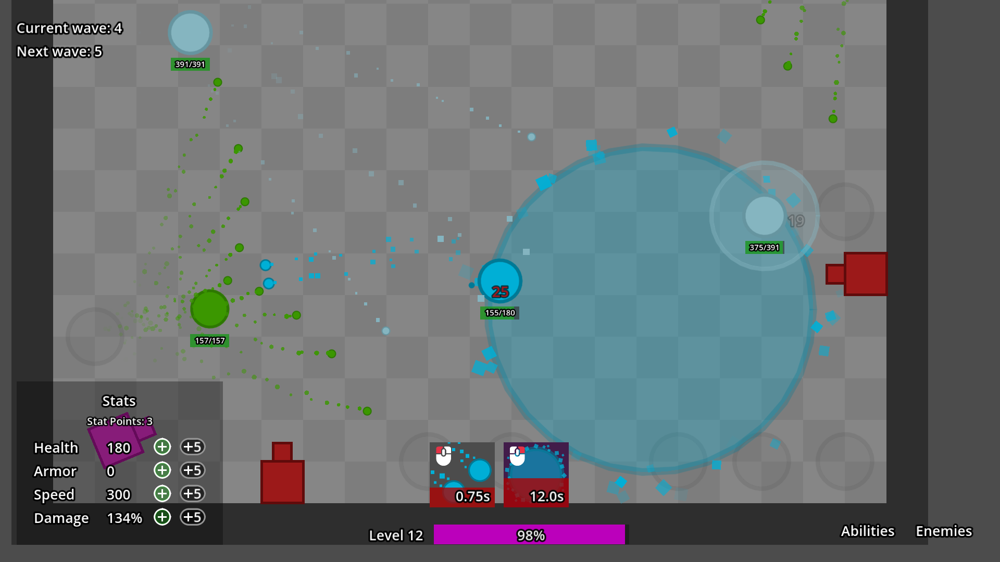

# Geoslayer
This is my project I started to learn how to develop games in Godot Engine better. I also wanted some practice.

The project uses Godot Engine 4.6.

## What is Geoslayer about?

Geoslayer is a 2D wave-based survival game with simple graphics. You use your 2 abilities to defeat incoming enemies. Beat the boss who spawns at the end to win.

Unlock abilities from chests you get for surviving waves, pick and choose which ones you want to use. Currently there are 15 player abilities in total.

You get XP by defeating enemies or opening chests. When you level up, you gain a few stat points you can use to upgrade your stats. When you win the game by defeating the boss and you exit the arena, the XP you earned is converted into permanent XP. When you level up permanently, you also gain stat points similar to stat points you earned in-game and you can use them to upgrade your stats permanently.

Your permament level is important when entering other worlds. Every world other than World 1 and World 0 (a testing world) will have a level requirement.

### Abilities
There are currently 15 abilities unlockable by the player. Other abilities can only be used by NPCs.

| Ability name | Ability description |
| ------------ | ------------------- |
| Shoot        | basic starter ability, fires a projectile |
| Doubleshot   | fires two projectiles in parallel |
| Cannonball   | fires a large and high-damage, but slow projectile, it also applies a huge knockback |
| Blast        | fires projectiles with huge knockback in all directions |
| Flurry       | fires multiple projectiles in quick succession |
| Wideshot     | fires multiple projectiles in a cone |
| Pierce       | fires a high-damage fast piercing projectile, but requires a cast |
| Explosive    | fires a projectile which explodes into more smaller projectiles on impact |
| Teleport     | teleports the caster |
| Summon       | spawns multiple minions who fight alongside the player |
| Storm        | spawns an area which damages and slows enemies down while they're standing in it |
| Lifesteal    | fires 3 projectiles which heal the caster for a portion of the damage dealt |
| Shred        | similar to Wideshot but close range and applies an armor and speed buff to the caster if the projectiles hit a target |
| Swipe        | performs a swipe melee attack |
| Smash        | deals damage to, stuns and knocks enemies around the caster back |

## Screenshot

