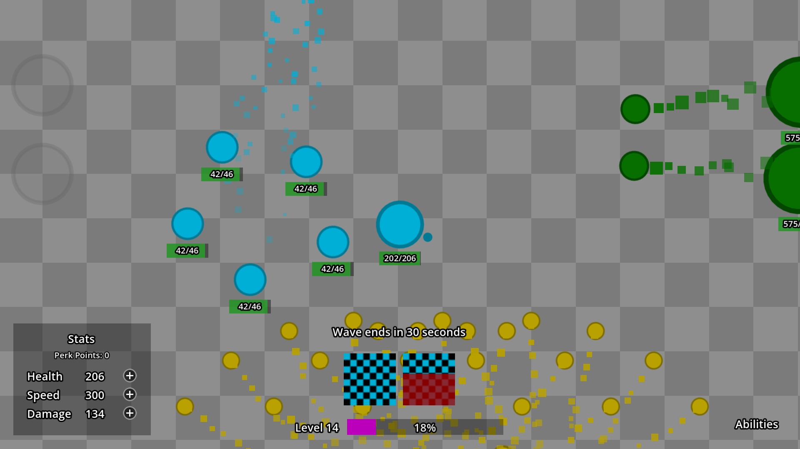
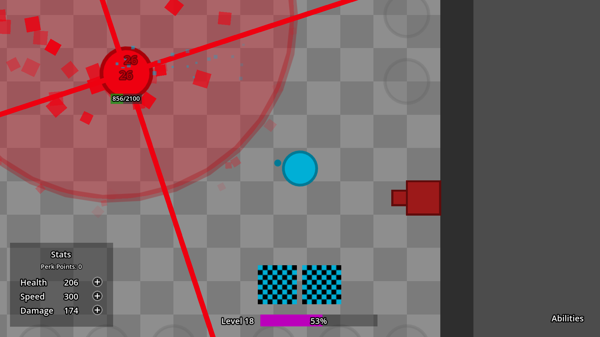
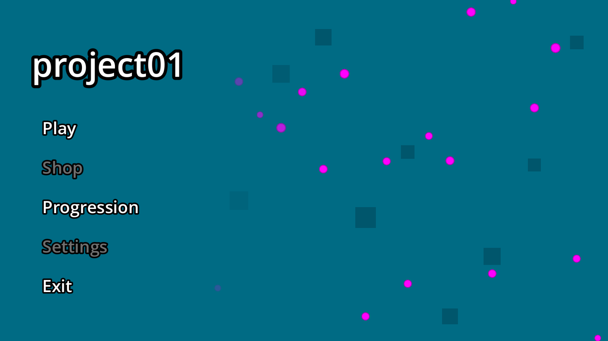
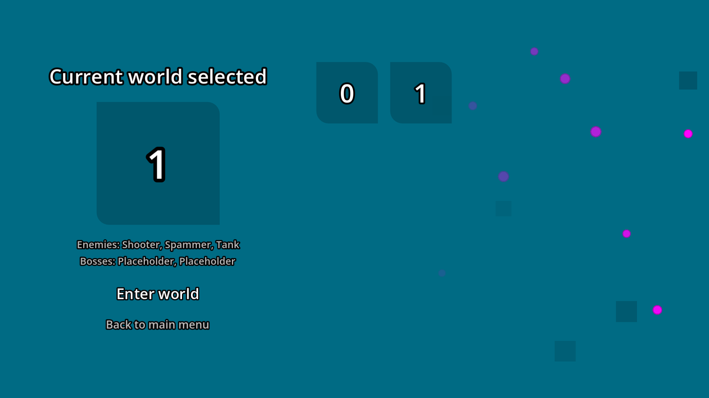
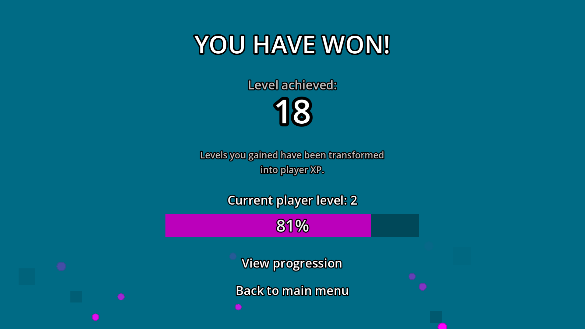
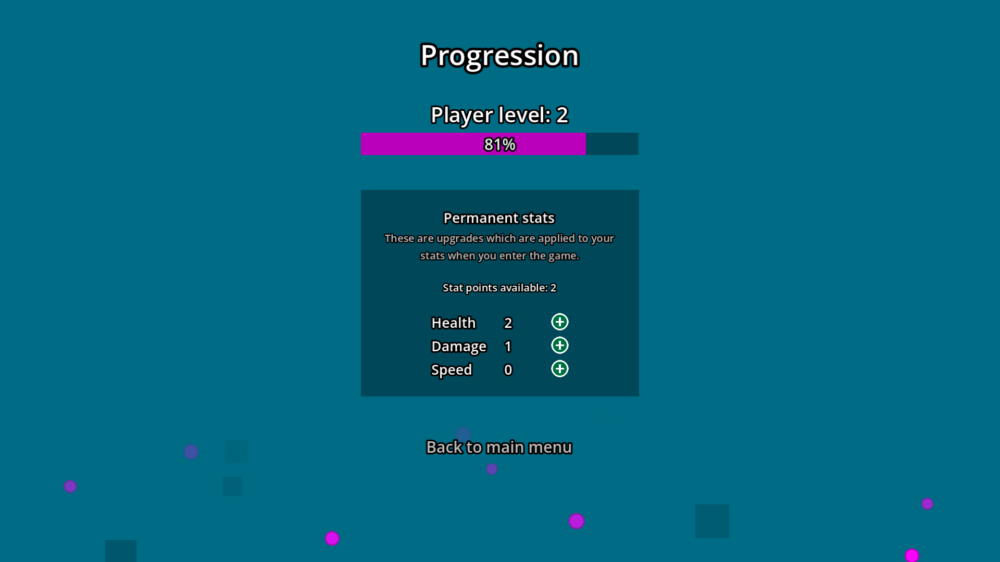

# project01
This is my Godot project I started to learn how to develop games in Godot better. Specifically, I wanted to structure my project better, use signals more, and overall just learn new things.

## What is this game about?

I don't have all features planned and I come up with a lot of stuff on the go. But to summarize: it's a 2D game with simple graphics where enemies come in waves. You use your 2 abilities to defeat them. Level up, grow stronger, and unlock new abilities. Upgrade your stats permanently to increase your power forever.

## What have I made so far?
1. Characters
2. Stat system (HP etc)
3. Ability system
4. Levels and XP
5. Simple main menu
6. Enemy waves
7. Implemented pathfinding with avoidance
8. World selection
9. Perk points
10. First boss
11. Win screen
12. Permanent progression (stat upgrades), saving and loading

### Abilities
There are currently 12 abilities unlockable by the player. Other abilities can only be used by NPCs.
1. **Shoot**: basic starter ability, fires a projectile
2. **Doubleshot**: fires two projectiles in parallel
3. **Cannonball**: fires a large and high-damage, but slow projectile
4. **Blast**: fires projectiles in all directions
5. **Flurry**: fires multiple projectiles in quick succession
6. **Wideshot**: fires multiple projectiles in a cone
7. **Pierce**: fires a high-damage fast piercing projectile, but requires a cast
8. **Explosive**: fires a projectile which explodes into more smaller projectiles on impact
9. **Teleport**: teleports the caster
10. **Summon**: spawns multiple minions who fight alongside the player
11. **Storm**: spawns an area which damages and slows enemies down while they're standing in it
12. **Lifesteal**: fires 3 projectiles which heal the caster for a portion of the damage dealt

## Screenshots of the current state

<table>
    <tr>
        
    </tr>
    <tr>
        
    </tr>
    <tr>
        <td></td>
        <td></td>
    </tr>
    <tr>
        <td></td>
        <td></td>
    </tr>
</table>