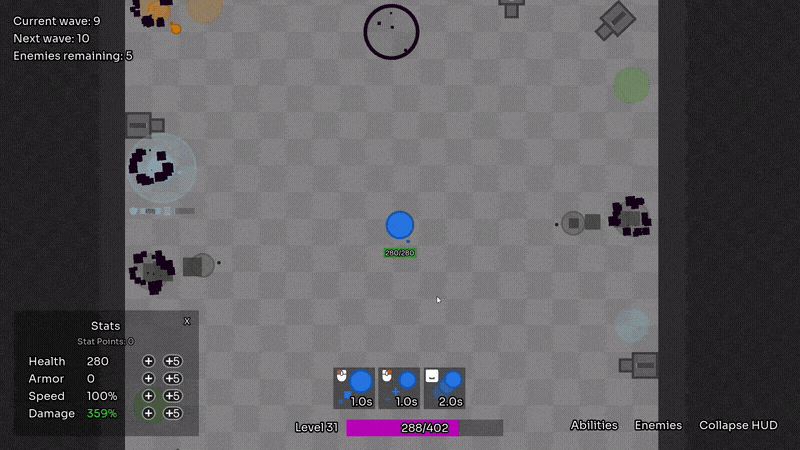

This is the repository for my game: Geoslayer. I'm currently working on version 0.2.2. The game is not completely finished yet, because I'd like to add more features and polish. It is definitely playable though.

To play the game, you can download the latest release [here](https://github.com/fmachek/geoslayer/releases/latest).

## Technologies used

* Godot Engine 4.7
* GDScript

## Overview

Geoslayer is a 2D wave survival game with simple graphics. You use your 2 abilities to defeat incoming enemies. You also have a dashing ability you can use to dodge incoming attacks. Beat the boss who spawns at the end to win.

Unlock abilities from chests you get for surviving waves. Currently there are 22 usable abilities in total. Also pick a temporary buff as a reward for surviving a wave.

You get XP by defeating enemies or opening chests. When you level up, you gain a few points you can use to upgrade your stats.

When you win, the XP you gained is converted into XP for your permanent level. When you level up, you gain points you can use to become stronger forever. These points can also drop from enemies.

Your permament level is important when entering different worlds. Worlds after World 1 require you to be at a certain level to enter.

### Gameplay showcase

### Player abilities

There are currently 22 abilities usable by the player. Abilities are unlocked from chests. Each ability has a theme, for example magical.

Regular abilities drop in World 1. World 2 adds magical abilities on top of that.

The player also always has a dodge ability alongside the two abilities they equip.

## Credits

Here is some of the stuff I used:

* Kenney: https://kenney.nl/
    * Some assets, such as UI icons
* Sora: https://fonts.google.com/specimen/Sora
    * Used in-game
    * Used in the game logo
